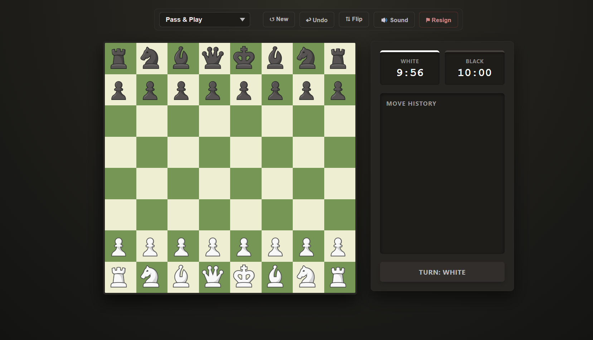

# ♟️ Chess Engine Pro

A fully playable chess game built with **vanilla JavaScript** — no frameworks, no libraries. Features a custom AI opponent powered by the **Minimax algorithm with Alpha-Beta Pruning**.



---

## 🚀 Live Demo

**[▶ Play the live game here](https://divyagarwal1.github.io/chess-engine-pro/)**
---

## ✨ Features

- **Full chess rules** — castling, en passant, pawn promotion, check/checkmate detection
- **Standard Algebraic Notation (SAN)** — move history log (e.g. `Nf3`, `O-O`, `exd5+`)
- **4 AI difficulty levels** via dropdown selector
  - Level 1 — Random moves
  - Level 2 — Greedy (1-ply lookahead)
  - Level 3 — Minimax with Alpha-Beta Pruning (3-ply lookahead)
  - Level 4 — Deep Minimax (4-ply lookahead, strongest)
- **Draw conditions** — Stalemate, 50-move rule, threefold repetition, insufficient material
- **Live 10-minute chess clock** — keeps ticking even while the AI is thinking
- **Pass & Play** mode for two human players
- **Undo move** — steps back one full move pair in AI mode
- **Board flip** — play from either side
- **Sound effects** — move, capture, castle, and check sounds via Web Audio API
- Visual indicators — move dots, capture rings, castling hints, check highlight

---

## 🤖 How the AI Works

The AI uses the **Minimax algorithm**, a classic decision-tree search used in game theory.

### Minimax
At each turn, the AI builds a tree of all possible moves up to a fixed depth. It assumes:
- The AI (black) will always pick the move that **minimises** the score
- The human (white) will always pick the move that **maximises** the score

```
           Root (AI to move)
          /        |        \
        e5        Nf6       d5        ← AI's possible moves
       / \        / \       / \
     ...  ...   ...  ...  ...  ...   ← Human's responses
```

### Alpha-Beta Pruning
A standard optimisation that **prunes branches** that cannot possibly affect the final result.  
This reduces the effective branching factor from ~35 to ~6, making deeper search practical.

- **Without pruning:** O(b^d) nodes evaluated
- **With pruning:** O(b^(d/2)) in the best case — effectively **doubles the search depth**

### Board Evaluation
Each position is scored using:
1. **Material value** — Pawn=100, Knight=320, Bishop=330, Rook=500, Queen=900, King=20000
2. **Piece-Square Tables (PST)** — bonus/penalty based on piece position (e.g. knights rewarded for centre control, pawns rewarded for advancing, king penalised for exposure)

---

## 📁 Project Structure

```
chess-engine-pro/
├── index.html        # Game layout and UI controls
├── style.css         # All styling — dark theme, animations
├── game.js           # Core game logic — move execution, game state, clocks
├── movements.js      # Pseudo-legal move generation for all piece types
├── ai.js             # Minimax engine, evaluation function, alpha-beta pruning
├── renderHtml.js     # DOM rendering — draws the board from game state
└── images/
    └── pieces/       # Piece images (white/black × 6 types)
```

---

## 🛠️ How to Run

No build step needed. Just open the file:

```bash
# Clone the repo
git clone https://github.com/DivyAgarwal1/chess-engine-pro.git

# Open in browser
cd chess-engine-pro
open index.html        # macOS
start index.html       # Windows
xdg-open index.html    # Linux
```

> **Note:** Chrome/Firefox required. The game uses ES Modules (`import/export`) so it needs to be served — if pieces don't load, use VS Code's **Live Server** extension or run:
> ```bash
> npx serve .
> ```

---

## 🧠 Technical Decisions

| Decision | Why |
|---|---|
| Vanilla JS, no framework | Demonstrates core JS skills; no abstraction hiding the logic |
| Immutable board cloning for AI | Each minimax node gets a full board copy — safe, no state mutation bugs |
| Clock runs during AI think time | Black's clock ticks even as the engine searches — fair, realistic time pressure |
| SAN move notation | Industry-standard chess notation; required for proper move logs |
| Separate `movements.js` | Move generation is reused by both the game engine and the AI — single source of truth |
| Dropdown mode selector | Clean UX — one control for all 5 modes (Pass & Play + 4 AI levels) |

---

## 🔮 What I'd Add Next

- [ ] Opening book (common openings database)
- [ ] Mobile touch support
- [ ] Iterative deepening for even stronger Level 4 play
- [ ] Transposition table (cache repeated positions to speed up search)
- [ ] Play as black option with auto board-flip

---

## 👤 Author

**Divy Agarwal** 3rd Year B.Tech Student  
👉 [LinkedIn](https://www.linkedin.com/in/divy-agarwal-066131319/) · [GitHub](https://github.com/DivyAgarwal1)

---

## 📄 License

MIT — free to use, modify, and distribute.